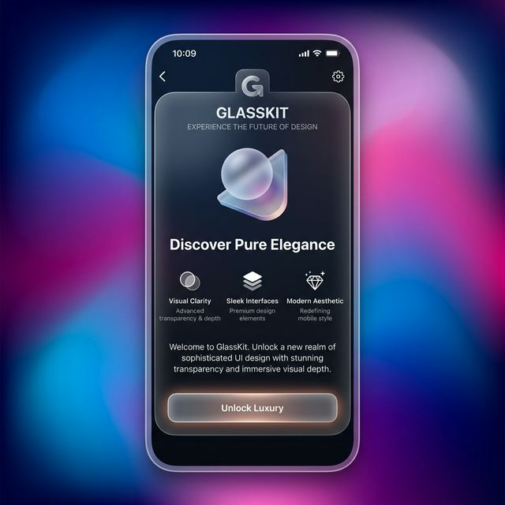

# GlassKit

A premium glassmorphism UI library for SwiftUI, bringing the elegance of Apple Vision Pro and macOS to your iOS apps.



## Features
- **Zero Boilerplate**: Apply glass effects with a simple `.glass()` modifier.
- **GlassCard**: Pre-styled container with frosted glass and glowing borders.
- **GlassButton**: Interactive glass buttons with scale effects.
- **GlassBackground**: Dynamic, vibrant mesh gradients to highlight transparency.
- **Backward Compatible**: Supports iOS 14+ via custom `BlurView` wrappers.

## Supported Platforms
- iOS 14.0+
- macOS 11.0+

## Installation

```swift
.package(url: "https://github.com/ErsanQ/GlassKit", from: "1.0.0")
```

## Usage

### Simple Glass Modifier
```swift
Text("Hello Glass")
    .glass() // Adds blur, border, and shadow
```

### Using Glass Components
```swift
ZStack {
    GlassBackground() // Colorful gradient
    
    GlassCard {
        VStack {
            Text("Premium Card")
            GlassButton("Tap Me") {
                print("Action")
            }
        }
    }
}
```

## Author
ErsanQ (Swift Package Index Community)
